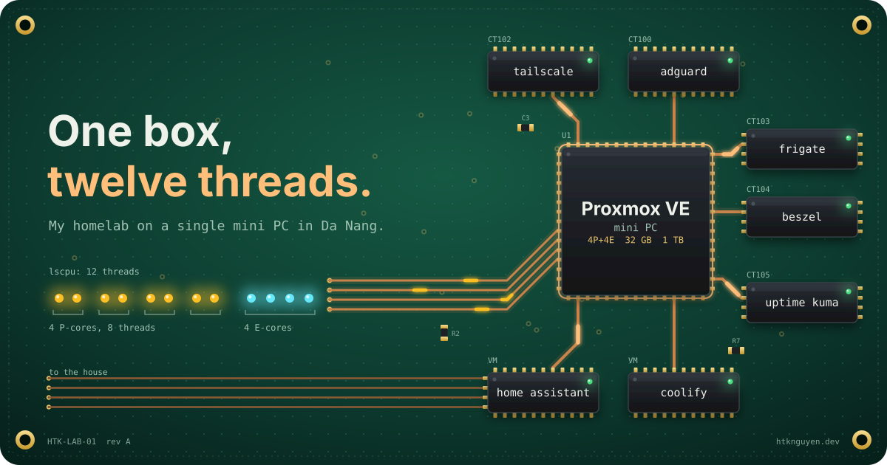
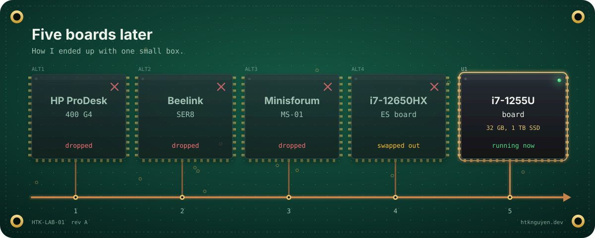
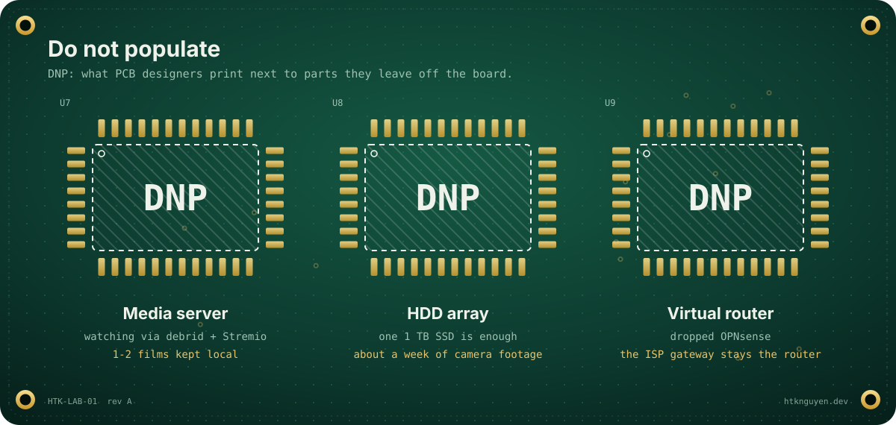
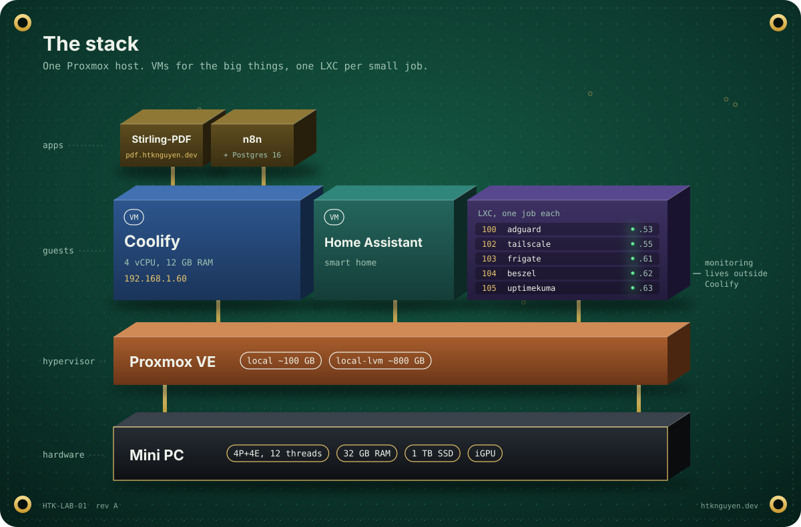
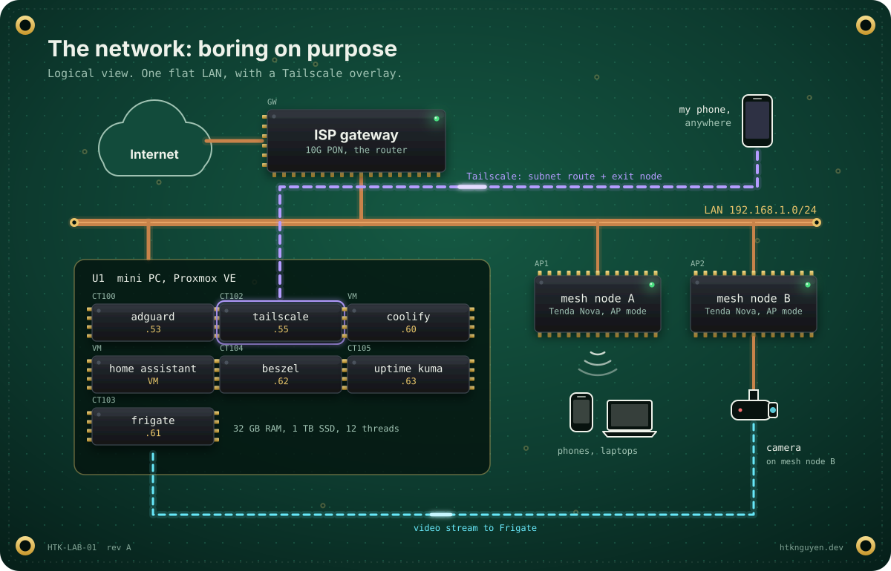
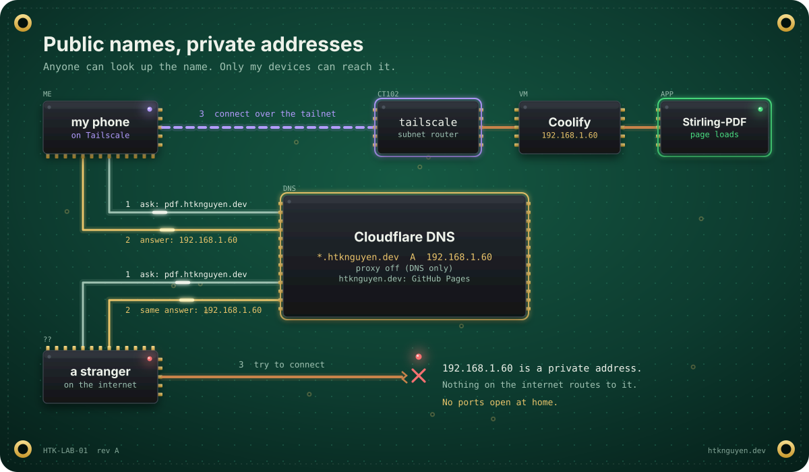
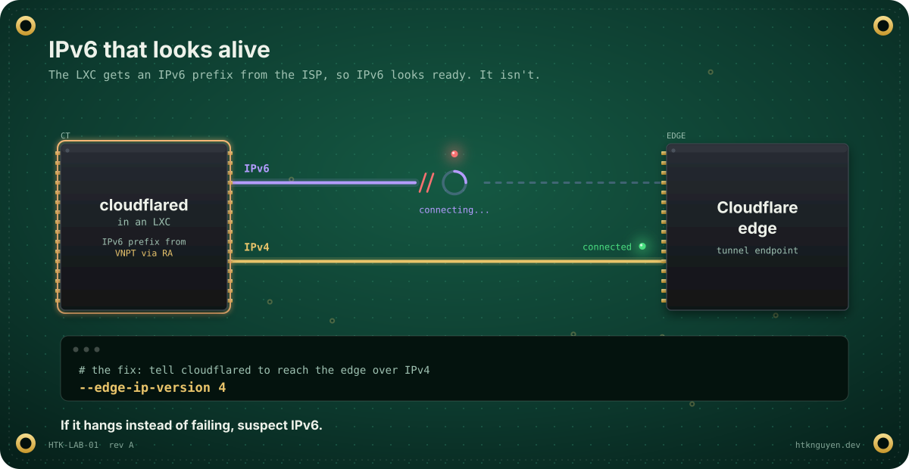
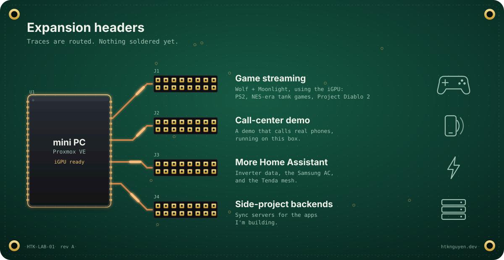

Most homelab stories I read start with a rack. Mine starts with one small box and two rules.

My day job is designing solutions for clients. At home I wanted the opposite: a machine I could change on a Sunday afternoon, break, and fix, without a change request. But it also had to be useful for the household, not just a toy.

So before buying anything, I wrote down two rules:

1. **It's a learning machine.** It can fail, and I accept that.
2. **When it fails, the house falls back to how it worked before.** Internet still on, nothing important lost.

Almost every decision below comes from those two lines.

## Five boards later



I went through more options than I want to admit: an HP ProDesk 400 G4, a Beelink SER8, a Minisforum MS-01, then a board with an i7-12650HX engineering sample. I ended up with a board sold as an **i7-1255U**, plus:

- 32 GB RAM (2 × 16 GB)
- One 1 TB SSD
- The integrated GPU (it matters later)

A mobile-class chip is a good fit for a box that runs 24/7: small, quiet, and easy on the power bill.

### The CPU that isn't what the box says

The first thing I ran was `lscpu`. Trimmed:

```text
Model name:      Genuine Intel(R) 0000
CPU(s):          12
CPU max MHz:     4000.0000
L3:              18 MiB (1 instance)
```

Threads 0–7 sit on four P-cores and threads 8–11 on four E-cores. A retail i7-1255U doesn't look like that.



| | Retail i7-1255U | My chip |
|---|---|---|
| Name | Intel Core i7-1255U | Genuine Intel(R) 0000 |
| Cores | 2 P + 8 E | 4 P + 4 E |
| Threads | 12 | 12 |
| L3 cache | 12 MB | 18 MB |
| Max boost | 4.7 GHz | 4.0 GHz |

Same thread count, different chip. "Genuine Intel(R) 0000" is the name you usually see on engineering samples, so my best guess is a pre-release part that ended up on a cheap board.

For a homelab, I'm fine with it. Four P-cores are nice for VMs, and I give up some single-core boost. For a production server, I would not take this risk: no official support, and no promise on stability.

Lesson: run `lscpu` on day one, before you trust the listing.

## What I decided not to run



Some of my best decisions were the things I left out.

- **No media server.** I watch through debrid + Stremio, so I keep at most one or two films locally.
- **No HDD array.** One 1 TB SSD. The biggest user is about a week of camera footage, and that fits.
- **No virtual router.** I planned OPNsense, then dropped it. The ISP gateway stays the router. If my box dies, the internet doesn't.

That last one is rule 2 in action. A virtual router is a great learning project, but it turns every Proxmox reboot into a household outage.

## The stack



Proxmox VE runs on the metal, with the default storage split: about 100 GB `local` and about 800 GB `local-lvm`. On top of it:

**Two VMs for the big things**

- **Coolify** (4 vCPU, ~12 GB RAM) runs my Docker apps. The first app was Stirling-PDF; n8n with Postgres came next.
- **Home Assistant** runs in its own VM.

**One LXC per small job**

| ID | Container | Job |
|---|---|---|
| 100 | adguard | DNS filtering for the house |
| 102 | tailscale | Subnet router and exit node |
| 103 | frigate | NVR for the cameras |
| 104 | beszel | Host and container metrics |
| 105 | uptimekuma | Uptime checks and alerts |

The split follows a simple rule of thumb. Apps I add and remove often go into Coolify. Infrastructure that other things depend on gets its own LXC. Monitoring especially: if the Coolify VM breaks, the tools watching it should not break with it. Uptime Kuma and Beszel each went in with the Proxmox community helper scripts.

## The network: boring on purpose



The network is simple, and I want it that way:

- The ISP's 10G PON gateway is the router.
- Two Tenda Nova mesh nodes run in AP mode on the same subnet.
- One camera plugs into a mesh node.
- Everything lives in `192.168.1.0/24`. AdGuard Home sits at `.53`, because of course it does.

Tailscale runs in its own LXC, not on the Proxmox host. It advertises `192.168.1.0/24` as a subnet route and works as an exit node. From anywhere, my phone sees the home network as if I were on the sofa. On café Wi-Fi, I can send all my traffic out through home.

## Public names, private addresses



This is my favorite trick in the whole setup. My domain `htknguyen.dev` uses Cloudflare for DNS:

| Record | Points to | Why |
|---|---|---|
| `htknguyen.dev`, `www` | GitHub Pages | This blog |
| `*.htknguyen.dev` | `192.168.1.60` (Coolify VM), DNS only | Every app gets a real name |

So `pdf.htknguyen.dev` resolves for anyone in the world, but the answer is a private address. On my LAN or my tailnet, it opens Stirling-PDF. From anywhere else, it goes nowhere.

What I get:

- Clean names for every app, with no port forwarding and nothing exposed to the internet.
- A new app in Coolify gets a new subdomain with no DNS change, thanks to the wildcard.

The trade-off: the names are not secret. But a name is not a way in.

## Where the homelab meets the house



Home Assistant is where the homelab touches real life.

The house runs on solar: 12 × 570 W panels (about 6.84 kWp), all facing west at a 15° tilt, on a LuxPower SNA6000 hybrid inverter with a battery. We don't sell power back to the grid. EVN bills homes on a tiered tariff, so every kWh we make and use ourselves is a kWh that never reaches the expensive upper tiers. West-facing panels produce most in the afternoon, which is also when the house is hottest.

What's connected so far:

- A **Broadlink IR/RF hub** in the bedroom controls the fan and the AC. The fan has no physical remote, so the hub *is* the remote.
- **Frigate** handles the cameras, sized for about a week of footage on the SSD.

Next on the list: inverter data (it has a Wi-Fi dongle), the Samsung AC, and monitoring the Tenda mesh, all inside Home Assistant.

## War stories

### IPv6 that looks alive



While setting up `cloudflared` in an LXC, the connection to Cloudflare just hung.

The cause: my LXCs get an IPv6 prefix from VNPT through router advertisements, so IPv6 looks ready. But outbound IPv6 connections hang, while IPv4 works fine. The fix was one flag:

```bash
--edge-ip-version 4
```

Lesson: when something hangs instead of failing, suspect IPv6.

### n8n settings that don't stick

n8n runs on Coolify from the n8n-with-postgresql template: n8n, task runners and Postgres 16, with the version pinned in the compose file. `N8N_HOST`, `WEBHOOK_URL` and `N8N_EDITOR_BASE_URL` are defined in that compose file, so the Environment tab is the wrong place to change them. Edit them in the compose editor.

### The tunnel I built and removed

I wanted a stable webhook URL for POCs, to stop juggling ngrok links. I set up Cloudflare Tunnel with `hooks.htknguyen.dev` in front of n8n. Then I decided to tear the whole thing down and put n8n back to its original config.

Not every experiment has to stay. The IPv6 lesson stayed; the tunnel didn't.

## What's next



- **Game streaming.** I can't run a cable from the server to the TV, so the plan is Wolf (Games on Whales) with Moonlight, using the iGPU: PS2 games, NES-era tank games, maybe Project Diablo 2.
- **A call-center demo** that calls real phones, running on this box.
- **More Home Assistant:** inverter data, the Samsung AC, the mesh.
- **Backends for side projects**, like sync servers for apps I'm building.

## What I'd tell myself on day one

- Write down what you will *not* run. It saves more time than any tool.
- Keep the router out of the lab.
- Big things in VMs, small infrastructure in LXCs, apps in Coolify.
- Private DNS plus Tailscale beats port forwarding.
- If it hangs instead of failing, suspect IPv6.
- Run `lscpu` before you trust the listing.

It isn't a rack. It's one small box, twelve threads, and a list of things I learned by breaking them. That's exactly what I wanted.
